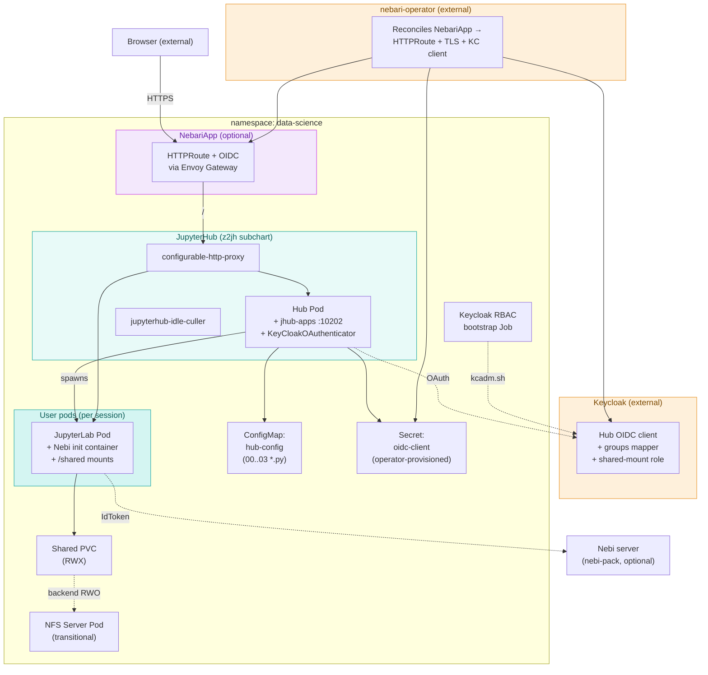

# Architecture

The pack is a Helm chart that lays down:

- The **JupyterHub** subchart (z2jh 4.3.2) — `hub`, `proxy`,
  `user-scheduler`, NetworkPolicies, RBAC.
- A custom **Nebari hub image** with `jhub-apps` and
  `KeyCloakOAuthenticator` pre-installed, with hub config files
  (`00-gateway-auth.py` → `03-nebi-envs.py`) mounted in from a
  ConfigMap.
- Optional **NebariApp** resources — when `nebariapp.enabled: true` the
  nebari-operator picks these up and provisions Envoy Gateway
  HTTPRoutes, TLS certificates, and (if auth is enabled) a Keycloak
  client.
- Optional **shared storage** — a `ReadWriteMany` PVC mounted into user
  pods as `/shared/<group>`, optionally backed by an in-cluster NFS
  server pod.
- A post-install **Keycloak RBAC bootstrap Job** — adds the group
  mapper and shared-mount client role to the hub OIDC client.

## Component diagram

## Resource walk-through

### JupyterHub subchart

The chart depends on
[`jupyterhub` 4.3.2](https://hub.jupyter.org/helm-chart/) (z2jh) and
threads every value under `jupyterhub.*` through to it. The subchart
provides the hub, proxy, user-scheduler, NetworkPolicies, and per-user
RBAC. The pack overrides only what's needed for jhub-apps, Keycloak,
profiles, and shared storage.

End users do not interact with the subchart directly. Operators see it
via `kubectl get pods -n data-science` (`hub-*`, `proxy-*`, optionally
`user-scheduler-*`).

### Hub pod

A single hub pod running the Nebari hub image
(`quay.io/nebari/nebari-data-science-pack-jupyterhub`) — z2jh's
JupyterHub plus jhub-apps and `KeyCloakOAuthenticator` baked in.

The pod mounts two extra things on top of z2jh's defaults:

- The chart's **hub-config ConfigMap** at
  `/usr/local/etc/jupyterhub/jupyterhub_config.d/`, containing
  `00-gateway-auth.py`, `01-spawner.py`, `02-jhub-apps.py`, and
  `03-nebi-envs.py` (Helm-rendered from `templates/hub-config.yaml`).
- The operator-provisioned **OIDC client Secret** at `/etc/oauth/` and
  as the `JUPYTERHUB_OIDC_CLIENT_SECRET` env var.

The hub also exposes a second service port (`10202`) for jhub-apps,
allowed through the hub's NetworkPolicy ingress and the proxy's
NetworkPolicy egress.

:::warning[`extraVolumes` is replace-not-merge]

z2jh treats `hub.extraVolumes` and `hub.extraVolumeMounts` as lists
that **replace, not merge**, on override. Deployer values that set
either must re-include the chart's `custom-config` and `oauth-client`
entries or hub config and `/etc/oauth/` disappear silently.

:::

### Proxy

The standard `configurable-http-proxy` from z2jh, exposed as the
`proxy-public` Service (the target of NebariApp routing and of
`kubectl port-forward` in local dev).

### User pods (JupyterLab)

Spawned on demand by the hub via KubeSpawner. The pack ships a custom
JupyterLab image
(`quay.io/nebari/nebari-data-science-pack-jupyterlab`) with a Pixi-based
Python environment, the Starship prompt, and jhub-apps frameworks
(Streamlit, Panel, Voilà, Bokeh, Gradio) installed.

Spawn-time pieces (driven by `config/jupyterhub/01-spawner.py`):

- A per-user home PVC (created via `01-spawner.py`, not via z2jh's
  `singleuser.storage` — `jupyterhub.singleuser.storage.type: none` is
  required because jhub-apps' `JHubSpawner` expects volumes as a list
  and the subchart's dynamic storage emits a dict).
- `/shared/<group>` mounts for every group the user's KC token carries
  (or — when RBAC is on — every group that holds the
  `allow-group-directory-creation-role`).
- A **Nebi init container** (when `nebi.image.tag` is set) that copies
  the `nebi` binary into the user pod's PATH. The pod then auto-connects
  to `nebi.remoteURL` using the user's KC IdToken on first launch.

### jhub-apps

[`jhub-apps`](https://jhub-apps.nebari.dev/) runs in the hub pod (port
`10202`, exposed as the `jhub-apps` Service port) and exposes the
launcher at `/services/japps/`. It registers user-created apps as
JupyterHub services, each running as a separate KubeSpawner-managed pod.

The chart's `jupyterhub.custom.japps-config` block is read by
`02-jhub-apps.py` and set as attributes on `c.JAppsConfig` before
`install_jhub_apps()`. Operators can override `hub_host`,
`service_workers`, allowed/blocked frameworks, additional services,
and startup apps — see
[jhub-apps configuration](https://jhub-apps.nebari.dev/docs/configuration).

### NebariApp (optional)

When `nebariapp.enabled: true`, the chart creates a single NebariApp CR
pointing at `proxy-public:80`. The
[nebari-operator](https://github.com/nebari-dev/nebari-operator)
watches NebariApps in `nebari.dev/managed` namespaces and provisions:

- An Envoy Gateway `HTTPRoute` for the hostname → proxy.
- A TLS certificate via cert-manager.
- (If `auth.enabled`) A Keycloak OIDC client and a Secret with
  `client-id` / `client-secret` / `issuer-url`. The hub picks this up
  via the mounted `oauth-client` Secret.

The nebari-operator handles the full lifecycle — changing
`nebariapp.hostname` rebuilds the routing and TLS without manual
intervention.

`nebariapp.auth.enforceAtGateway` and `forwardAccessToken` are
deliberately `false`: the hub runs its own `KeyCloakOAuthenticator`,
which persists tokens to `auth_state` for downstream services
(jhub-apps, Nebi). Layering Envoy's OIDC filter on top adds nothing and
its cookie rotation stales `auth_state` for `/services/japps/*` paths.

### Shared PVC (and optional NFS server)

When `sharedStorage.enabled: true`, the chart creates:

- A `ReadWriteMany` PVC sized to `sharedStorage.size`.
- (Optionally) An **in-cluster NFS server pod** (when
  `sharedStorage.nfsServer.enabled: true`) backed by a RWO PVC, which
  re-exports `/` as RWX. A transitional fallback for clusters without
  a native RWX class — preferred path is Longhorn or another cluster
  RWX class.
- (Optionally) An **`nfs-client-installer` DaemonSet** (when
  `sharedStorage.nfsServer.installClient: true`) that runs `apt install
  nfs-common` on every node. Required on k3s / minimal-OS nodes that
  ship without NFS client tools.

The spawner (`01-spawner.py`) computes which `/shared/<group>`
subPaths to mount based on the user's KC token (filtered by
`sharedStorage.groups` if non-empty, and further filtered by the
shared-mount role when RBAC is on).

### Keycloak RBAC bootstrap Job

A post-install / post-upgrade Helm Job (`rbac.bootstrap.enabled: true`,
on by default) that runs `files/keycloak_rbac_bootstrap.py` against
Keycloak's admin REST API. It:

1. Adds the `oidc-group-membership-mapper` to the `groups` client
   scope — fixes the empty-`groups`-claim bug.
2. Creates the `allow-group-directory-creation-role` client role on
   the hub OIDC client.
3. Enables `serviceAccountsEnabled` on the hub client and binds
   `realm-management.{view-clients,view-groups,view-realm}` to its
   service account.
4. Assigns the shared-mount role to the KC groups in
   `rbac.bootstrap.sharedMountGroups`.
5. Patches the hub OIDC client's `rootUrl` / `baseUrl` /
   `initiate.login.uri` so KC-initiated SSO lands on
   `/hub/oauth_login`, not `/hub/oauth_callback`.

The Job runs in the `keycloak` namespace by default so it can read
the bitnami/keycloakx admin Secret without cross-namespace copies.
Idempotent — re-runs are safe.

## Request flows

### Login (production, OIDC enabled)

1. Browser → `https://jupyter.<cluster>/` → Envoy Gateway.
2. Envoy → HTTPRoute → `proxy-public:80` → hub pod.
3. Hub redirects to KC `/realms/nebari/protocol/openid-connect/auth`.
4. User authenticates against KC; browser lands on
   `/hub/oauth_callback?code=…`.
5. Hub exchanges the code for tokens, stores them in `auth_state`, and
   sets the JupyterHub session cookie.
6. Subsequent requests pass through directly until the cookie expires.

`enforceAtGateway: false` means Envoy is **not** running its OIDC
filter on this path — the entire OAuth flow lives in the hub. The
`forwardAccessToken: false` block likewise keeps Envoy out of the
token-forwarding chain; downstream services (jhub-apps, Nebi) read
tokens from `auth_state` via the hub's KC token exchange in
`02-jhub-apps.py` / `03-nebi-envs.py`.

### Spawn

1. User clicks **Start** with a profile selected.
2. KubeSpawner (via `01-spawner.py`) builds the pod spec — image from
   the profile, per-user home PVC, `/shared/<group>` mounts, Nebi init
   container (when `nebi.image.tag` is set).
3. Pod scheduled, init container copies the `nebi` binary, main
   container starts JupyterLab on `:8888`.
4. Hub registers the new server with the proxy; browser is redirected
   to `/user/<name>/lab`.

### jhub-apps deploy

1. User opens `/services/japps/` (jhub-apps launcher on the hub pod).
2. Submits a Create App form (framework + entry point + visibility).
3. jhub-apps registers the app as a JupyterHub service.
4. The hub spawns a service pod (separate from the user's JupyterLab
   pod) running the framework wrapper around the user's script.
5. App URL is added to the launcher row.

## What the operator mutates at runtime

When ArgoCD or Helm applies the chart, the spec it ships is *not* what
ends up in the cluster after the controllers reconcile. The
nebari-operator specifically:

- Mutates the **NebariApp** status conditions
  (`RoutingReady`, `TLSReady`, `AuthReady`, …).
- Creates / updates the **OIDC client Secret** with operator-managed
  rotation. The hub's `oauth-client` volumeMount with `optional: true`
  tolerates the Secret not existing until the operator gets to it.

KubeSpawner also creates per-user PVCs and pods on demand; those are
not in any rendered chart manifest.

## Where each setting takes effect

| Chart setting | Resource it changes | When it applies |
|---|---|---|
| `jupyterhub.hub.image.tag` | Hub Deployment | Rolling restart of the hub. |
| `jupyterhub.singleuser.image.tag` + `jupyterhub.custom.profiles[*].image` | Profile list + new user pods | Existing sessions keep the old image; next spawn picks the new tag. |
| `nebariapp.hostname` / `nebariapp.auth.*` | NebariApp CR | nebari-operator updates HTTPRoute / TLS / KC client in place. |
| `sharedStorage.*` | Shared PVC + (optional) NFS server | Existing user pods keep the old mounts until restarted. |
| `nebi.remoteURL` + `nebi.image.tag` | hub-config ConfigMap → next spawn | Next spawn gets the Nebi init container and auto-connect config. |
| `rbac.bootstrap.sharedMountGroups` | Keycloak realm (via Job) | Job re-runs on next helm upgrade and idempotently re-assigns roles. |

## Further reading

- [Zero to JupyterHub](https://z2jh.jupyter.org/) — the upstream
  JupyterHub Helm chart this pack subcharts.
- [jhub-apps](https://jhub-apps.nebari.dev/) — the JupyterHub
  extension for deploying long-running data apps.
- [nebari-operator](https://github.com/nebari-dev/nebari-operator) —
  the NebariApp CRD and the operator that backs it.
- [nebi-pack](https://github.com/nebari-dev/nebari-nebi-pack) — the
  Nebi team-server pack that pairs with this one.
