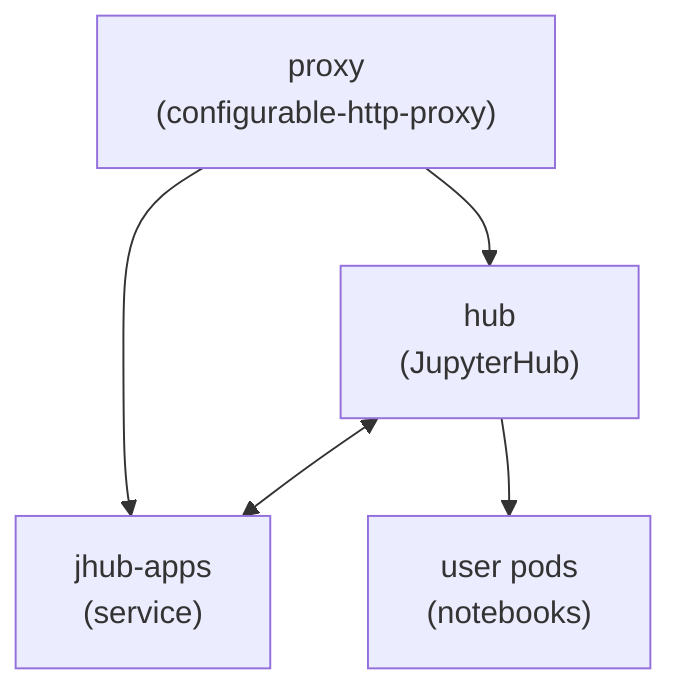

+++
title = "Architecture"
weight = 2
description = "How the proxy, hub, jhub-apps, and user pods fit together."
+++

The chart deploys JupyterHub behind a configurable HTTP proxy, with jhub-apps as
a companion service and user notebook pods spawned on demand.

## Components

| Component | Role |
|-----------|------|
| **proxy** | The configurable-http-proxy that fronts the deployment and routes requests to the hub and to running user servers. |
| **hub** | JupyterHub itself: authentication, the spawner, and the API. |
| **jhub-apps** | A companion service for deploying and sharing data science applications. |
| **user pods** | Notebook servers spawned per user, running Nebari's custom singleuser image. |

## Request flow

Traffic enters through the proxy. The proxy routes hub and API paths to the hub,
app paths to jhub-apps, and per-user paths to that user's running notebook pod.
The hub and jhub-apps talk to each other directly so apps can be launched and
managed from the hub UI.

## Storage

When shared storage is enabled, every user pod mounts per-group directories under
`/shared/<group>`, backed by a ReadWriteMany volume. See
[Shared Storage](/docs/shared-storage/) for the storage class requirements.
